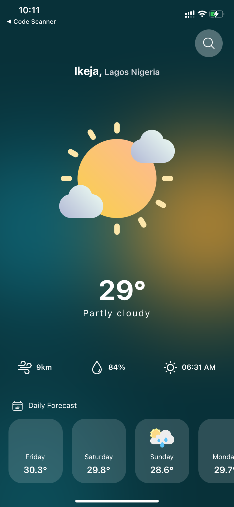
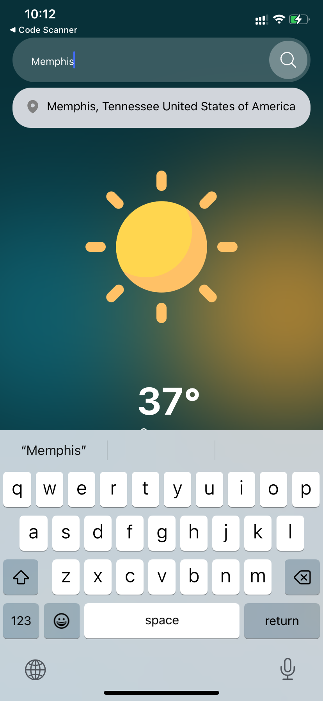

> *Weather App*

Welcome to the Weather App! This app provides real-time weather information based on your location, powered by the WeatherAPI.com service.

Features
Real-time Weather Data: Get up-to-date weather information for your current location.
Location-Based Forecast: Receive detailed forecasts based on your current location.
Custom Locations: Easily search for and save multiple locations for quick access to weather updates.
Hourly and Daily Forecasts: View both hourly and daily weather forecasts to plan your activities.

> *Technologies Used*

React Native: Utilized for building the cross-platform mobile application.
Expo: Simplified the development process by providing tools and services for React Native projects.
Weather API: Leveraged to fetch weather data, including degree, wind, and forecast.
TailWind CSS: Frontend component library for styling.

> *Getting Started*

To get started with the Weather App, follow these steps:

*Clone the Repository:* Clone this repository to your local machine using the following command:

*command:* git clone https://github.com/Cypher-O/WeatherApp.git

Set up your WeatherAPI.com API key:
Sign up for an account at WeatherAPI.com.
Generate an API key.

*Install Dependencies:* Navigate to the project directory and install the necessary dependencies by running:

*Command:* cd WeatherApp

*command:* npm install

*command:* npx expo start

*Run on Device/Emulator:* Use the Expo Go app to run the application on your physical device, or launch an emulator to test it on a virtual device.

> *Contributing*
> 
Contributions are welcome! Please follow these steps:

Fork the repository.
Create a new branch: git checkout -b feature/my-feature.
Make your changes and commit them: git commit -am 'Add new feature'.
Push to the branch: git push origin feature/my-feature.
Submit a pull request.

<table>
  <tr>
    <td></td>
    <td></td>
    <td></td>
    <td></td>
    <td></td>
  </tr>
</table>
